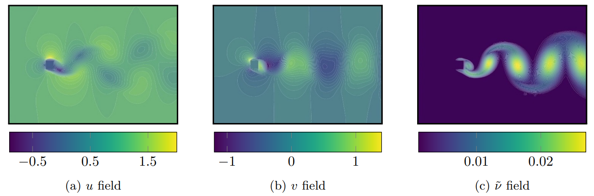

# cnn_spallart_allmaras

A project concerned with the prediction of turbulent viscosity field from an input velocity field using patch-based CNN architectures. If you exploit this work for your own research, please consider citing <a href="https://aip.scitation.org/doi/pdf/10.1063/5.0064458">the article</a> or <a href="https://arxiv.org/abs/2107.11235">the pre-print</a>. **This work was produced during the PhD thesis of <a href="https://github.com/aakash30jan">A. Pattil</a>.**

<p align="center">
  
</p>

## Abstract:

From the simplest models to complex deep neural networks, modeling turbulence with machine learning techniques still offers multiple challenges. In this context, the present contribution proposes a robust strategy using patch-based training to learn turbulent viscosity from flow velocities, and demonstrates its efficient use on the Spallart-Allmaras turbulence model. Training datasets are generated for flow past two-dimensional obstacles at high Reynolds numbers and used to train an auto-encoder type convolutional neural network with local patch inputs. Compared to a standard training technique, patch-based learning not only yields increased accuracy but also reduces the computational cost required for training.

## Install Requirements

```bash
cd transport
pip install -r requirements.txt
cd train
pip install -r requirements.txt
```

Make sure you install TF2.0 with GPU support.  

## Pre-process the training data

Make sure the training data is stored at `case_dir`  

```bash
cd transport
python3 preprocess.py
```

The current `preprocess.py` looks for `.vtu` files in `case_sample/resultats/2d/bulles*.vtu` . Modify the `case_dir`, `resultats_dir`, `fileListVTU` to accomodate your training dataset containing `.vtu` files of interest. 

## Train the model

```console
cd train
make train
```

You may clean the previous training data, if any, by 

```console
cd train
make clean
```

The file `train.py` is self-explanatory: We first load the system and user-defined libraries, set the training parameters, load the pre-processed dataset, make a patched-data, load the model architectures, define training and validation steps to suit TF2.0, and then perform the training. Make sure cuda-capabale devices and drivers are visible to Tensorflow, you may need to `module load cudaxxx` depending on the machine configuration. 
